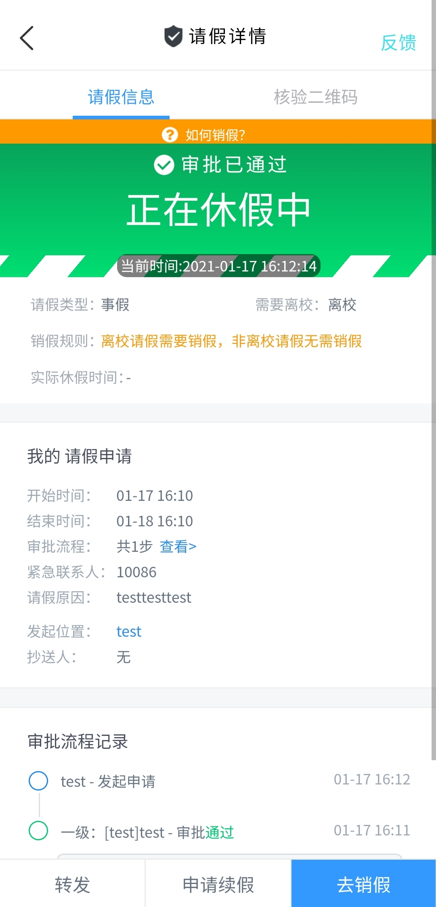
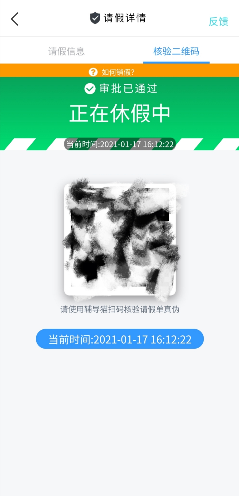

# **Leave-School**

##### 今日校园模拟请假软件(带核验码)

---

##  **使用须知**

##### 本软件使用[Uni-App](https://uniapp.dcloud.io/)编写

基于[Agonery133/jinrixiaoyuan](https://github.com/Agoney133/jinrixiaoyuan) 进行的二次开发

##### 软件仅供学习研究使用，请勿用于任何商业非法用途，否则造成任何后果作者概不负责！！！

请大家严格遵守学校和国家的相关规定，软件仅供学习研究使用，请勿用于商业及非法用途。

##  优化更新

2021-03-04 更新内容：

- 解决了右滑返回上一级的反人性化操作。
- 修复时间处理错误问题。
- 去除模拟签到功能。

2020-01-17 原作者版本未更新核验码功能，本次二开做出了以下优化：

- 优化使用界面，更加还原真实度。
- 增加核验码功能。

##  平台使用

支持安卓/IOS。

## 软件截图

